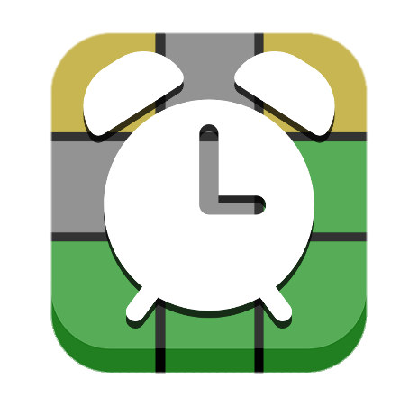
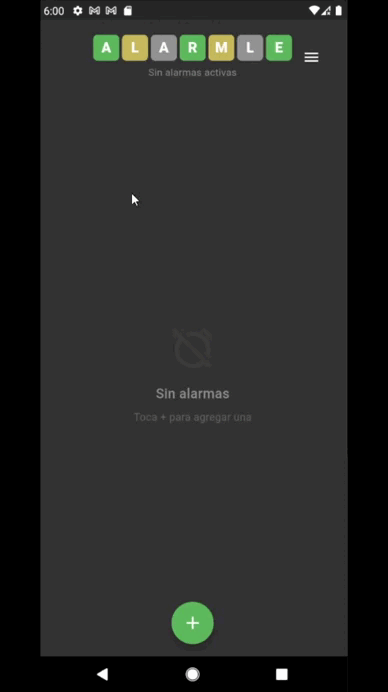
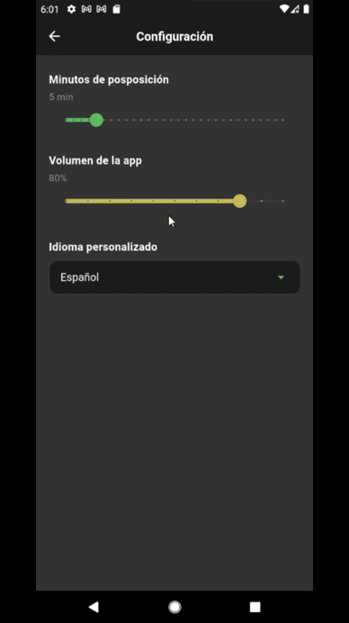
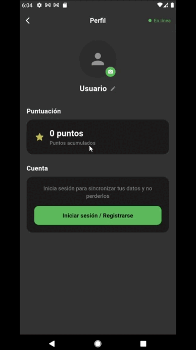
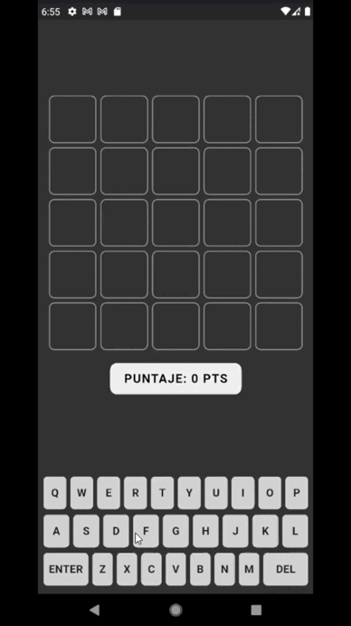
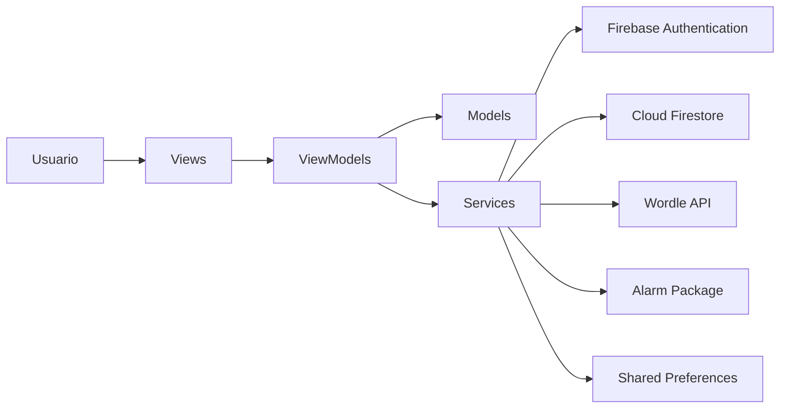
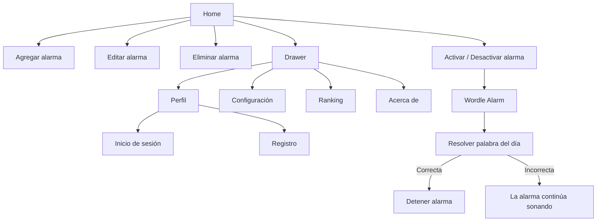
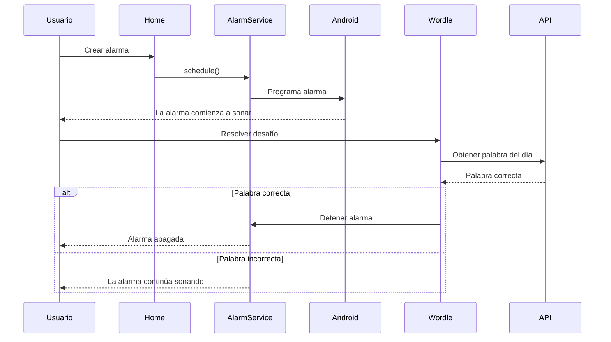

# ⏰ Alarmle

  

  
  
  
  
  
  

---

# 📖 Descripción

**Alarmle** es una aplicación móvil desarrollada en **Flutter** para dispositivos **Android**, cuyo objetivo es reducir la posibilidad de que el usuario vuelva a quedarse dormido después de que suene una alarma.

A diferencia de las aplicaciones tradicionales de alarmas, Alarmle incorpora una mecánica inspirada en el popular juego **Wordle**. Para apagar una alarma, el usuario debe adivinar correctamente la **palabra oficial del día**, obtenida en tiempo real desde la API pública del **New York Times**.

La aplicación integra servicios de **Firebase Authentication** y **Cloud Firestore** para gestionar el registro, autenticación y almacenamiento de información de los usuarios, además de ofrecer un sistema de ranking basado en el puntaje acumulado, el cual se calcula según los intentos que toma resolver el mini-juego estilo Wordle que aparece al sonar la alarma.

---

# 🎯 Problema que resuelve

Muchas personas tienen la costumbre de apagar una alarma mientras aún están somnolientas y volver a dormir, provocando retrasos en actividades importantes como asistir al trabajo, clases o reuniones.

Alarmle busca solucionar este problema obligando al usuario a realizar una actividad cognitiva antes de desactivar la alarma. Al requerir resolver el desafío de la palabra del día, se incrementa el nivel de atención y disminuye la probabilidad de quedarse dormido nuevamente.

---

# ✨ Características principales

## 🔔 Gestión de alarmas

- Crear alarmas.
- Editar alarmas.
- Eliminar alarmas.
- Activar y desactivar alarmas.
- Configurar repetición por días.
- Seleccionar tono personalizado.
- Activar y desactivar vibracion.

---

## 🎮 Modo Wordle

- Obtiene automáticamente la palabra oficial del día.
- El usuario debe descubrir la palabra para detener la alarma.
- Si la respuesta es incorrecta, la alarma continúa sonando.
- La validación se realiza utilizando la API oficial de Wordle del New York Times.

---

## 👤 Gestión de usuarios

- Registro mediante correo electrónico.
- Inicio de sesión mediante correo.
- Inicio de sesión con Google.
- Eliminación de cuenta.
- Cierre de sesión.

---

## 🏆 Ranking

- Tabla de puntajes entre usuarios.
- Actualización automática del puntaje.
- Top 10 almacenado en Cloud Firestore.

---

## 🌎 Internacionalización

La aplicación soporta múltiples idiomas:

- Español
- Inglés
- Francés
- Portugués
- Chino

---

## ⚙ Configuración

- Cambio de idioma.
- Configuración del volumen.
- Tiempo de posposición.

---

# 📱 Vista de funcionalidades

| creacion alarma | configuraciones |
|--------|------|
|  |  |

| inicio de sesion | wordle |
|--------------|---------------|
|  |  |

---

# 🛠 Tecnologías utilizadas

| Tecnología | Uso |
|------------|-----|
| Flutter | Desarrollo de la interfaz |
| Dart | Lenguaje de programación |
| Firebase Authentication | Registro e inicio de sesión |
| Cloud Firestore | Base de datos NoSQL |
| Provider | Gestión de estado |
| HTTP | Consumo de la API de Wordle |
| Alarm Package | Programación de alarmas |
| Shared Preferences | Configuración local |
| Google Sign-In | Inicio de sesión con Google |
| Connectivity Plus | Detección de conexión |
| Image Picker | Selección de imagen de perfil |
| File Picker | Selección de archivos |
| Path Provider | Gestión de rutas locales |

---

# 🏛 Arquitectura del proyecto

Alarmle implementa el patrón de arquitectura **MVVM (Model - View - ViewModel)**.

Este patrón permite desacoplar la lógica de negocio de la interfaz gráfica, facilitando el mantenimiento del código, la reutilización de componentes y la escalabilidad del proyecto.

La arquitectura se encuentra dividida en cuatro capas principales:

- **Model:** representa las entidades del sistema.
- **View:** contiene las pantallas e interfaz gráfica.
- **ViewModel:** administra la lógica de negocio y el estado.
- **Services:** encapsula la comunicación con Firebase, la API de Wordle y los servicios del dispositivo.

Los datos fluyen desde la interfaz hacia los ViewModels, los cuales interactúan con los servicios correspondientes para obtener o actualizar información.

---

## Diagrama de Arquitectura (MVVM)

---

# 🧭 Navegación de la aplicación

La navegación de Alarmle está organizada alrededor de una pantalla principal (**Home**) desde la cual el usuario administra sus alarmas y accede al resto de funcionalidades mediante un menú lateral (*Drawer*).

Las acciones relacionadas con las alarmas (crear, editar, activar, desactivar y eliminar) se realizan directamente desde la pantalla principal, mientras que las configuraciones y la información del usuario se encuentran agrupadas en pantallas independientes.

## Diagrama de navegación

---

# 🗄 Base de datos NoSQL (Cloud Firestore)

Alarmle utiliza **Cloud Firestore** como base de datos NoSQL para almacenar la información de los usuarios registrados.

Actualmente la aplicación utiliza una única colección denominada **users**, donde cada documento corresponde a un usuario autenticado.

## Colección `users`

| Campo | Tipo | Descripción |
|--------|------|-------------|
| uid | String | Identificador único del usuario. |
| name | String | Nombre visible del usuario. |
| email | String | Correo electrónico registrado. |
| score | Integer | Puntaje acumulado del usuario. |
| createdAt | Timestamp | Fecha de creación de la cuenta. |

> **Nota:** Las alarmas no se almacenan en Firestore. Son administradas localmente mediante el paquete **alarm**, el cual programa las alarmas directamente en el dispositivo Android.

---

# 🌐 Matriz de endpoints consumidos

## API Wordle (New York Times)

La aplicación obtiene diariamente la palabra oficial desde la API pública del New York Times para validar la resolución del desafío.

---

## 🔐 AuthService

Responsable de gestionar la autenticación de los usuarios mediante **Firebase Authentication** y **Google Sign-In**.

### Responsabilidades

- Registro mediante correo electrónico.
- Inicio de sesión con correo.
- Inicio de sesión con Google.
- Verificación del correo electrónico.
- Recarga de la información del usuario.
- Cierre de sesión.
- Eliminación de la cuenta.

---

## 👤 FirestoreService

Encargado de administrar la información almacenada en **Cloud Firestore**.

Toda la información del usuario se almacena en la colección `users`.

### Responsabilidades

- Crear usuario.
- Obtener información del usuario.
- Actualizar nombre.
- Actualizar puntaje.
- Obtener ranking.
- Eliminar usuario.

---

## ⏰ AlarmService

Servicio encargado de gestionar las alarmas utilizando el paquete **alarm**.

Las alarmas son administradas localmente por el dispositivo Android y no requieren almacenamiento en Firestore.

### Responsabilidades

- Inicializar el sistema de alarmas.
- Programar nuevas alarmas.
- Cancelar alarmas.
- Cancelar todas las alarmas.
- Configurar vibración.
- Configurar tono personalizado.
- Mostrar notificaciones en pantalla completa.

---

## 🌐 ConnectivityService

Servicio responsable de monitorear el estado de la conexión a Internet del dispositivo.

### Responsabilidades

- Detectar conexión Wi-Fi.
- Detectar conexión móvil.
- Detectar ausencia de conexión.
- Notificar cambios a la interfaz.

Este servicio es utilizado para informar al usuario cuando la aplicación pierde conectividad, requisito indispensable para utilizar la autenticación y obtener la palabra diaria desde la API de Wordle.

---

## 💾 StorageService

Servicio encargado de administrar el almacenamiento local utilizado por la aplicación.

### Responsabilidades

- Guardar imágenes de perfil.
- Gestionar rutas locales.
- Persistencia de archivos.

---

# 🔄 Flujo de funcionamiento

El siguiente diagrama representa el flujo principal de la aplicación desde que el usuario crea una alarma hasta que logra apagarla.

---

# ⚙ Instalación

## Requisitos

- Android 8.0 o superior.
- Conexión a Internet.
- Permisos de notificaciones.

## Instalación mediante APK

1. Descargar el archivo APK desde el siguiente enlace:

> **[⬇ Descargar APK (arm64-v8a) — 21.9 MB](./release/app-arm64-v8a-release.apk)**
> 
> También disponible para [armeabi-v7a](./release/app-armeabi-v7a-release.apk) y [x86_64](./release/app-x86_64-release.apk)

2. Habilitar la instalación desde orígenes desconocidos en Android.

3. Instalar la aplicación.

4. Iniciar sesión o crear una cuenta(opcional).

5. Comenzar a crear alarmas.

---

# 🔑 Permisos utilizados

Alarmle solicita únicamente los permisos necesarios para su funcionamiento.

| Permiso | Motivo |
|----------|--------|
| Internet | Inicio de sesión y consulta de la API Wordle. |
| Notificaciones | Mostrar las alarmas programadas. |

---

# 📦 Dependencias principales

| Dependencia | Uso |
|--------------|-----|
| provider | Gestión de estado |
| firebase_core | Inicialización de Firebase |
| firebase_auth | Autenticación |
| cloud_firestore | Base de datos |
| google_sign_in | Inicio de sesión con Google |
| http | Consumo de API |
| alarm | Programación de alarmas |
| shared_preferences | Configuración local |
| connectivity_plus | Estado de conexión |
| image_picker | Selección de imagen |
| file_picker | Selección de archivos |
| path_provider | Acceso al almacenamiento |

---

# 📈 Trabajo futuro

Las siguientes funcionalidades se consideran posibles mejoras para futuras versiones.

- Sincronización de alarmas entre dispositivos.
- Más modos de dificultad para Wordle.
- Compatibilidad con Wear OS.
- Compatibilidad con iOS.

---

# 👨‍💻 Autores

**Matías Poblete y Martin Bravo**

Universidad de Talca

Ingeniería en Desarrollo de Videojuegos y Realidad Virtual

---

# 📬 Contacto

En caso de dudas, consultas o querer reportar algun error dentro de la app, comunicarse con alguno de los autores a traves de los siguiente correos:
capi.bara.mp.2026@gmail.com
drakzoncode@gmail.com

